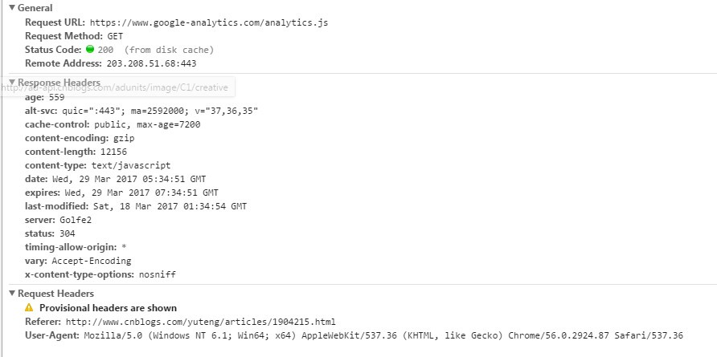

### 2020/8/19 从输入 URL 到页面加载完成，发生了什么？

+ 浏览器的地址栏输入URL并按下回车
+ 浏览器查找当前URL是否存在缓存，并比较缓存是否过期
+ 首先我们需要通过 DNS（域名解析系统）将 URL 解析为对应的 IP 地址
+ 然后与这个 IP 地址确定的那台服务器建立起 TCP 网络连接（三次握手）
+ 随后我们向服务端抛出我们的 HTTP 请求
+ 服务端处理完我们的请求之后，把目标数据放在 HTTP 响应里返回给客户端，拿到响应数据的浏览器就可以开始走一个渲染的流程。
+ 渲染页面，构建DOM树。
+ 渲染完毕，关闭TCP连接（四次挥手），页面便呈现给了用户，并时刻等待响应用户的操作（如下图所示）。

## 一：URL
+ 我们常见的RUL是这样的：http://www.baidu.com；
+ 这个域名由三部分组成：协议名、域名、端口号，这里端口是默认所以隐藏。
+ 除此之外URL还会包含一些路径、查询和其他片段，例如：http://www.tuicool.com/search?kw=%E4%。
+ 我们最常见的的协议是HTTP协议，除此之外还有加密的HTTPS协议、FTP协议、FILe协议等等。
+ URL的中间部分为域名或者是IP，之后就是端口号了。
+ 通常端口号不常见是因为大部分的都是使用默认端口，如HTTP默认端口80，HTTPS默认端口443。
## 二：DNS域名解析
我们知道在地址栏输入的域名并不是最后资源所在的真实位置，域名只是与IP地址的一个映射。网络服务器的IP地址那么多，我们不可能去记一串串的数字，因此域名就产生了，域名解析的过程实际是将域名还原为IP地址的过程。
1. 首先浏览器先检查本地hosts文件是否有这个网址映射关系，如果有就调用这个IP地址映射，完成域名解析。
2. 如果没找到则会查找本地DNS解析器缓存，如果查找到则返回。
3. 如果还是没有找到则会查找本地DNS服务器，如果查找到则返回
4. 最后迭代查询，按根域服务器 ->顶级域,.cn->第二层域，hb.cn ->子域，www.hb.cn的顺序找到IP地址。
## 三：TCP连接
##### 在通过第一步的DNS域名解析后，获取到了服务器的IP地址，在获取到IP地址后，便会开始建立一次连接，这是由TCP协议完成的，主要通过三次握手进行连接。
1. 第一次握手： 建立连接时，客户端发送syn包（syn=j）到服务器，并进入SYN_SENT状态，等待服务器确认； 
2. 第二次握手： 服务器收到syn包，必须确认客户的SYN（ack=j+1），同时自己也发送一个SYN包（syn=k），即SYN+ACK包，此时服务器进入SYN_RECV状态；
3. 第三次握手： 客户端收到服务器的SYN+ACK包，向服务器发送确认包ACK(ack=k+1），此包发送完毕，客户端和服务器进入ESTABLISHED（TCP连接成功）状态，完成三次握手。

##### 完成三次握手，客户端与服务器开始传送数据。
## 四：浏览器向服务器发送HTTP请求
#####完整的HTTP请求包含请求起始行、请求头部、请求主体三部分。

## 五、浏览器接收响应
##### 服务器在收到浏览器发送的HTTP请求之后，会将收到的HTTP报文封装成HTTP的Request对象，并通过不同的Web服务器进行处理，处理完的结果以HTTP的Response对象返回，主要包括状态码，响应头，响应报文三个部分。
+ 状态码主要包括以下部分:
1. 1xx：指示信息 – 表示请求已接收，继续处理。
2. 2xx：成功 – 表示请求已被成功接收、理解、接受。（200，201，202，203，204，205，206，207）
3. 3xx：重定向 – 要完成请求必须进行更进一步的操作。
4. 4xx：客户端错误 – 请求有语法错误或请求无法实现。（404 Not Found，请求失败，请求所希望得到的资源未被在服务器上发现）
5. 5xx：服务器端错误 – 服务器未能实现合法的请求。（503 Service Unavailable，由于临时的服务器维护或者过载，服务器当前无法处理请求。这个状况是临时的，并且将在一段时间以后恢复。500 Internal Server Error服务器遇到了一个未曾预料的状况，导致了它无法完成对请求的处理。一般来说，这个问题都会在服务器端的源代码出现错误时出现。）
6. 600：Unparseable Response Headers 源站没有返回响应头部，只返回实体内容。
##### 响应头主要由Cache-Control、 Connection、Date、Pragma等组成。
##### 响应体为服务器返回给浏览器的信息，主要由HTML，css，js，图片文件组成。
## 六：页面渲染
##### 如果说响应的内容是HTML文档的话，就需要浏览器进行解析渲染呈现给用户。整个过程涉及两个方面：解析和渲染。在渲染页面之前，需要构建DOM树和CSSOM树。
- 在浏览器还没接收到完整的 HTML 文件时，它就开始渲染页面了，在遇到外部链入的脚本标签或样式标签或图片时，会再次发送 HTTP 请求重复上述的步骤。在收到 CSS 文件后会对已经渲染的页面重新渲染，加入它们应有的样式，图片文件加载完立刻显示在相应位置。在这一过程中可能会触发页面的重绘或重排。这里就涉及了两个重要概念：Reflow和Repaint。
  - Reflow，也称作Layout，中文叫回流，一般意味着元素的内容、结构、位置或尺寸发生了变化，需要重新计算样式和渲染树，这个过程称为Reflow。
  - Repaint，中文重绘，意味着元素发生的改变只是影响了元素的一些外观之类的时候（例如，背景色，边框颜色，文字颜色等），此时只需要应用新样式绘制这个元素就OK了，这个过程称为Repaint。
  - 所以说Reflow的成本比Repaint的成本高得多的多。DOM树里的每个结点都会有reflow方法，一个结点的reflow很有可能导致子结点，甚至父点以及同级结点的reflow。
##### 下面这些动作有很大可能会是成本比较高的：
1. 增加、删除、修改DOM结点时，会导致Reflow或Repaint
2. 移动DOM的位置，或是搞个动画的时候
3. 内容发生变化
4. 修改CSS样式的时候
5. Resize窗口的时候（移动端没有这个问题），或是滚动的时候
6. 修改网页的默认字体时
##### 基本上来说，reflow有如下的几个原因：
1. Initial，网页初始化的时候
2. Incremental，一些js在操作DOM树时
3. Resize，其些元件的尺寸变了
4. StyleChange，如果CSS的属性发生变化了
5. Dirty，几个Incremental的reflow发生在同一个frame的子树上
## 七：关闭TCP连接或继续保持连接
##### 通过四次挥手关闭连接(FIN ACK, ACK, FIN ACK, ACK)。
+ 第一次挥手是浏览器发完数据后，发送FIN请求断开连接。
+ 第二次挥手是服务器发送ACK表示同意，如果在这一次服务器也发送FIN请求断开连接似乎也没有不妥，但考虑到服务器可能还有数据要发送，所以服务器发送FIN应该放在第三次挥手中。
+ 这样浏览器需要返回ACK表示同意，也就是第四次挥手。

